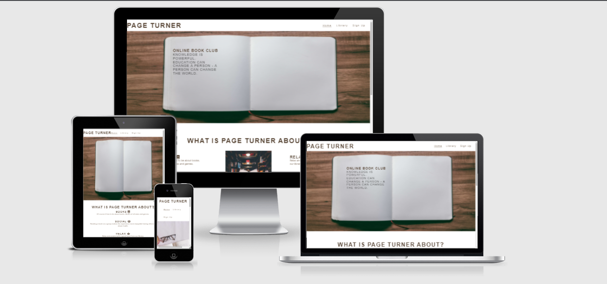
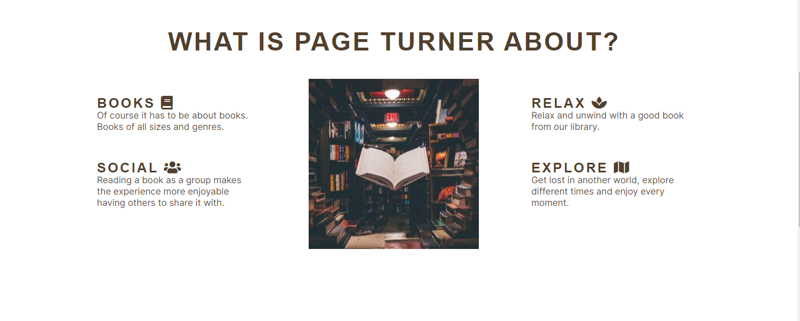

# Page Turner

This was a project to create a place for everyone to read books and discuss them freely. The website gives people an understanding of what the site is about and what books they could read. 

- __Published site available here: [Page Turner](https://cwilson1993.github.io/Page-Turner-PP1/)__

## Features

- __Navigation Bar__

  - The navigation bar is featured on all pages. It includes links to the Home page, Library and Sign Up page. The navigation bar is the same on all pages and responsive.
  - There is no need need for a back button as you can easily return to any page by clicking the relevant one. An active class shows which page the user is on at the moment.

- __Hero image home page__
  - The hero image gives a nice feel that this is about books. It has an inspirational quote. The image is replaced by another image for the mobile version.

- __About Section__
  - The about section gives four key points which tell the user what the site is about and also why it might be for them.
  - It gives just enough information without overloading the user.

- __Testimonial Section__
  - The testimonial section gives prospective users an idea of what current memmbers experiences have been.  
  - There is a star rating for each review as this can give an idea of what the sentiment of the comment might be.
