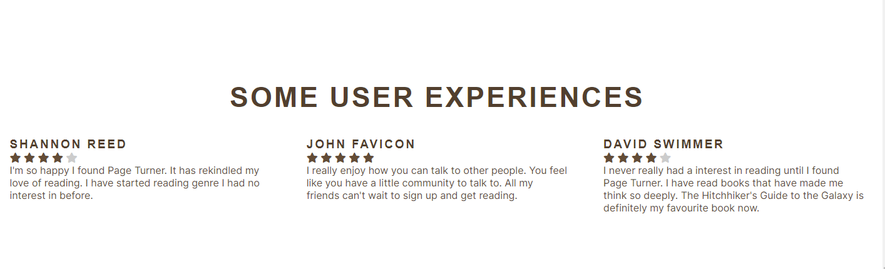
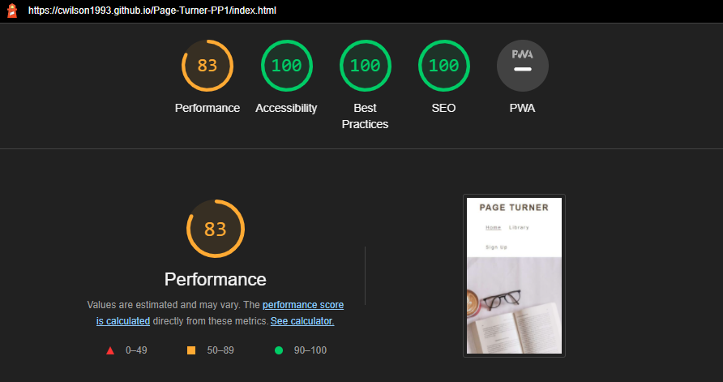
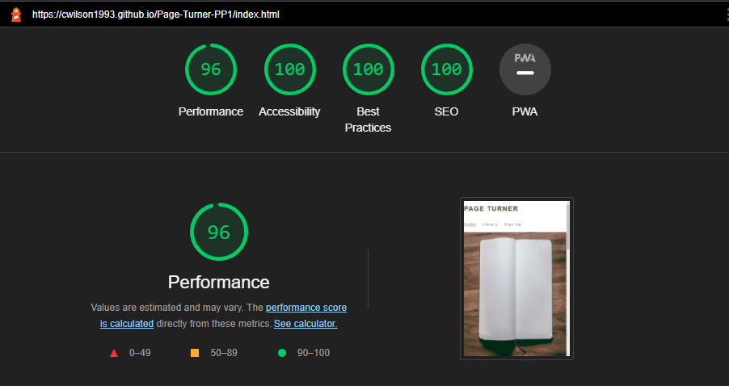

# Page Turner

This was a project to create a place for everyone to read books and discuss them freely. The website gives people an understanding of what the site is about and what books they could read. 

- __Published site available here: [Page Turner](https://cwilson1993.github.io/Page-Turner-PP1/)__

## Features

- __Navigation Bar__

  - The navigation bar is featured on all pages. It includes links to the Home page, Library and Sign Up page. The navigation bar is the same on all pages and responsive.
  - There is no need need for a back button as you can easily return to any page by clicking the relevant one. An active class shows which page the user is on at the moment.

- __Hero image home page__
  - The hero image gives a nice feel that this is about books. It has an inspirational quote. The image is replaced by another image for the mobile version.

- __About Section__
  - The about section gives four key points which tell the user what the site is about.
  - It gives just enough information without overloading the user and help them understand why Page Turner is for them.

- __Testimonial Section__
  - The testimonial section gives prospective users an idea of what current memmbers experiences have been.  
  - There is a star rating for each review as this can give an idea of what the sentiment of the comment might be.

- __Footer__
  - The footer contains the social media links which open on a new tab to the different platforms. 
  - The footer is identical on each page of the site and it also contains an address for Page Turner.
  - Users can easily follow Page Turner on the different social platforms.

- __Library Page__
  - The library gives user an idea of the books that are available to read at Page Turner.
  - Rather than show titles in text the images stick out more and help the users visualize what's on offer.

- __Signup Page__
  - The signup page contains a hero image where the sign up form overlays the image. 
  - The entry boxes include placeholder text to guide users so the sign up process is smoother.
  - When the user submits the information the form is replaced by overlayed text thanking them for signing up.

## Testing

For the testing I apply a number of different methods.

- __Responsiveness testing__
  - I used dev tools in Goggle Chrome to see what my site looked like at different screen sizes. 

- __Google Lighthouse__
  - I used another useful add on, Google Lighthouse, which measured the performance of the site on mobile and desktop screens.

 

- __Casual Testing__
  - I sent the site to some family and friends for testing. They tested it on the screens they use normally, some having mainly apple products and others had android devices. I also tested this myself on my on mobile. All the devices used displayed the content correctly and as I expected it to. 

- __Online Validators__
  - All the HTML code was run through [W3C Validator](https://validator.w3.org/#validate_by_input) and all the CSS code was run through [W3C CSS Validator](https://jigsaw.w3.org/css-validator/#validate_by_input). 
  - There were zero errors returned from both validators.
  - All the backup screenshots can be found below:
    - [Home Page](assets/docs/HTML_Validator_index.html.png)
    - [Library Page](assets/docs/HTML_Validator_library.html.png)
    - [Sign Up Page](assets/docs/HTML_Validator_signup.html.png)
    - [Complete Page](assets/docs/HTML_Validator_complete.html.png)
    - [CSS Code](assets/docs/CSS_Validator_style.css.png)

## Deployment

- The site was deployed using GitHub pages. The steps are quite straightforward once you have a GitHub account and repository already set up:
  - In the GitHub repository screen click the "Settings" section.
  - Under "Code and automation" click the "Pages" part.
  - On the next screen make sure the "Branch" is set to main and the folder is set to root, once done press the save button.
  - Above the source section it will initially say "Your site is ready to be published", after a few minutes this should change to "Your site is published" it will also include the URL for your site.

## Credits

### Content
- The code for the header section was taken from the Love Running module and altered for this site.
- The icons in the footer and about section where taken from [Font Awesome](https://fontawesome.com/)
- Used the Code Institute notes to guide me on the layout and design.
- Used [CSS Tricks](https://css-tricks.com/snippets/css/a-guide-to-flexbox/) and also a helpful video [Learn Flexbox the easy way](https://www.youtube.com/watch?v=u044iM9xsWU&t=786s) to help me understand flex.
- Used [Color Hunt](https://colorhunt.co/) to help me decide on a color scheme.

### Images
- The images used where all taken from one of the below sites:
  - [Pexels](https://www.pexels.com/)
  - [Pixabay](https://pixabay.com/)
  - [Amazon.co.uk](https://www.amazon.co.uk/)
  - [Dubray Books](https://www.dubraybooks.ie/)